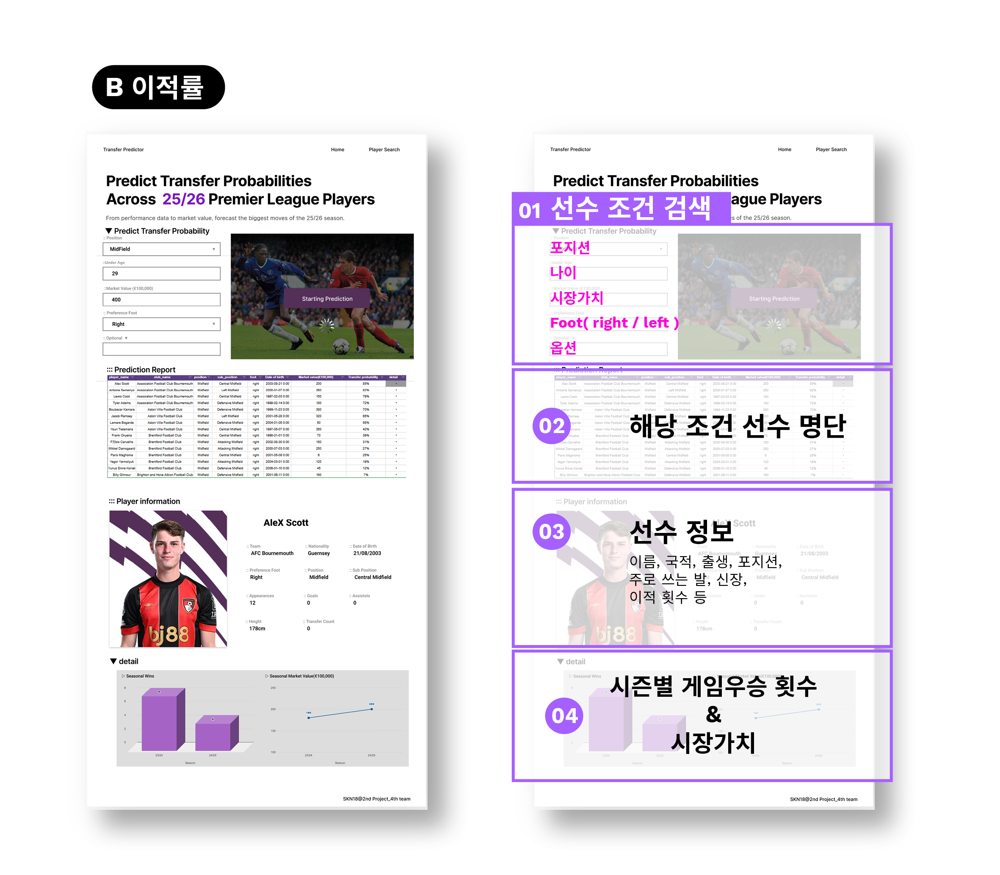
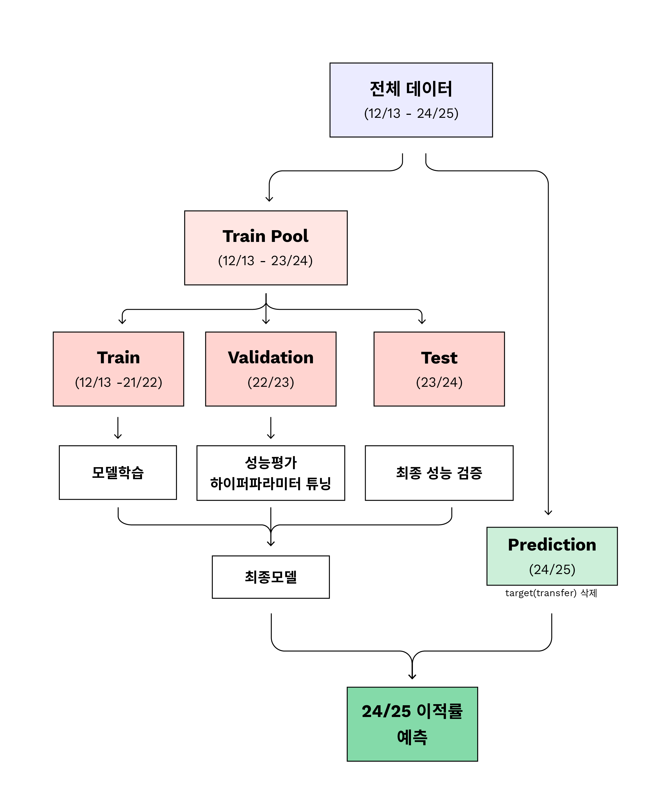
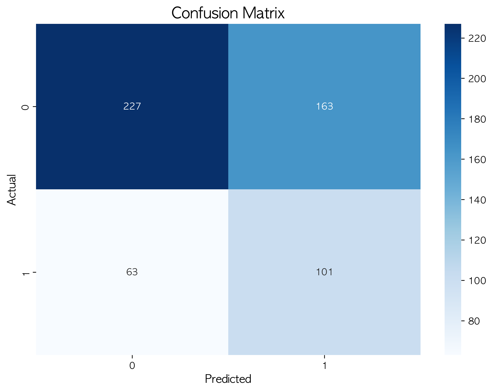
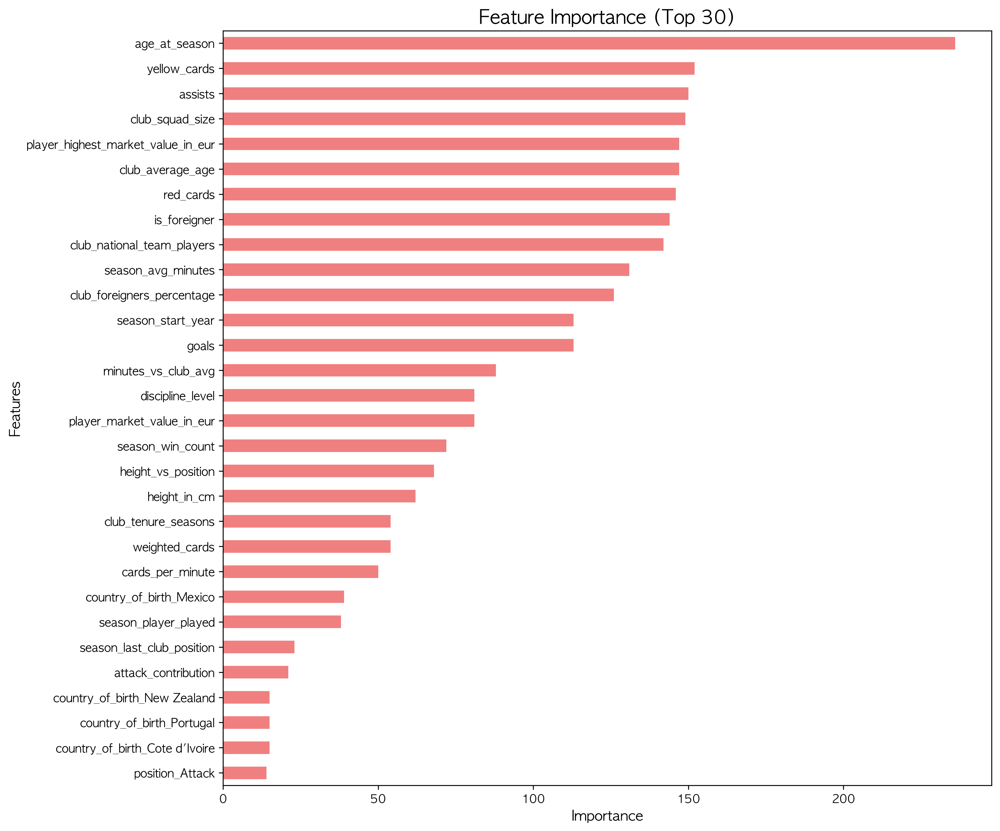
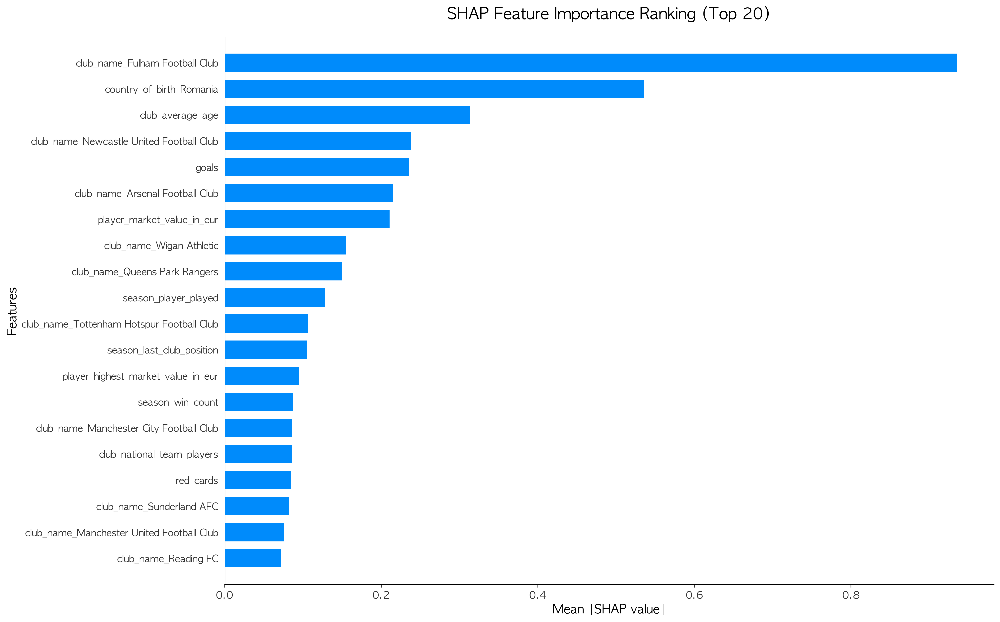

# Football Transfer Prediction Project

## 👥 프로젝트 팀 소개

## 🏃🏻 팀 이름 : 발로차

### 🖥️ 팀원 역할

|  이름  | 역 할  |   세부 역할    | Github         |
| :----: | :----: | :------------: | :------------- |
| 임승옥 | 팀장👑 | streamlit 구현 | @Seung-OK Im   |
| 김수미 |  팀원  |   모델 학습    | @ghyeju0904    |
| 손주영 |  팀원  |  데이터 처리   | @sonjuyeong-00 |
| 양진아 |  팀원  |     모듈화     | @JINA1003      |
| 정동석 |  팀원  |   모델 학습    | @dsj-1004      |

## 📋 프로젝트 개요

## ⚽ 프로젝트명 : 프리미엄리그 선수 정보 탐색 및 이적 가능성 예측 플랫폼 개발

## 📈 프로젝트 소개 및 기대효과

- 주요기능:
  - 1. 세계에서 인기 있는 리그 중 하나인 프리미엄리그의 선수 정보 탐색 및 향후 이적 가능성 확인 플랫폼
  - 2. 실시간 선수 탐색 + AI 기반 이적 예측 웹 서비스 제공
- 서비스 제공
  - 1차 타겟:구단·스카우터·에이전트(B2B)
  - 2차 타겟: 스포츠 산업 파트너 및 일반 팬
- 필요성 및 시장성
  - 1. 전 세계 수억 명 팬덤을 가진 프리미엄리그, 데이터 기반 선수 탐색 및 이적 예측 수요 증가
  - 2. 구단의 효율적 영입 전략과 리스크 관리에 필요한 AI 기반 분석 도구 제공
  - 3. 글로벌 스포츠 데이터 분석 시장은 매년 20% 이상 성장하고 있으며,리그·스포츠 베팅·중계 방송사 등 관계자들이 선수 데이터와 이적 예측 정보를 적극적으로 활용하고 있어 수용이 증가함.

## 🎯 주요 목표

- **이적 예측**: 24/25 시즌 선수들의 이적 가능성 예측
- **모델 비교**: 8개 머신러닝 모델의 성능 비교 및 최적 모델 선택
- **피처 엔지니어링**: 13개의 고급 피처를 통한 예측 성능 향상
- **오버피팅 분석**: 학습 곡선과 검증 곡선을 통한 모델 안정성 평가

## 데이터 정보

### 데이터 출처

- **Kaggle** Football Data from Transfermarkt 데이터 (https://www.kaggle.com/datasets/davidcariboo/player-scores?select=competitions.csv)

### 데이터 범위

- 전체 축구 리그 중 프리미어리그(GB1) 데이터 추출
- 시간 범위 : `12 ~ 25`

## 화면구성

### 웹 애플리케이션 소개

<table>
<tr>
<td width="50%">

**메인 화면**

- 선수 검색 및 필터링 기능
- 실시간 데이터 업데이트
- 직관적인 사용자 인터페이스

</td>
<td width="70%">


</td>
</tr>
<tr>
<td width="30%">

**선수 상세 정보**

- 개인 통계 및 성과 분석
- 이적 예측 결과 시각화
- 상세한 데이터 분석 제공

</td>
<td width="70%">



</td>
</tr>
</table>

### 요구사항

- 데이터 수집 및 통합
- 데이터베이스 설계 및 구축
- 24/25시즌 epl 참가 선수 조회 시스템
- 24/25 선수 개인 활약 기반 이적 예측 시스템
- 시각화 및 사용자 UI

## 🛠️ 기술 스택

### Frontend

- **Streamlit**: 웹 애플리케이션 개발 및 배포

### Backend

- **Python**: 3.13 - 메인 개발 언어

### UI/UX

- **Figma**: 사용자 인터페이스 설계 및 프로토타이핑

### Environment

- **Visual Studio Code**: 통합 개발 환경
- **Git**: 버전 관리 시스템
- **Github**: 코드 저장소 및 협업 플랫폼

### Communication

- **Discord**: 팀 커뮤니케이션 및 협업

### 핵심 라이브러리

- **Pandas**: 데이터 처리 및 조작
- **NumPy**: 수치 연산
- **Scikit-learn**: 머신러닝 파이프라인
  - `ColumnTransformer`: 피처 타입별 전처리
  - `SimpleImputer`: 결측치 처리 (중앙값/최빈값)
  - `StandardScaler`: 수치형 피처 정규화
  - `OneHotEncoder`: 범주형 피처 인코딩
  - `Pipeline`: 전처리-모델 파이프라인 구축

### 머신러닝 모델

- **Linear Models**: Logistic Regression, SVM
- **Tree-based**: Decision Tree, Random Forest
- **Boosting**: Gradient Boosting, XGBoost, LightGBM
- **Instance-based**: K-Nearest Neighbors

### 모델 해석 및 시각화

- **SHAP**: 모델 해석 (TreeExplainer, LinearExplainer, KernelExplainer)
- **Matplotlib**: 기본 시각화
- **Seaborn**: 통계 시각화

### 개발 도구

- **Joblib**: 모델 직렬화
- **Logging**: 실행 로그 관리
- **Pathlib**: 파일 경로 관리

## 📊 데이터 구조

`data/raw/` (원본 데이터)

```
├── players.csv              # 선수 기본 정보 (이름, 생년월일, 포지션, 키 등)
├── clubs.csv                # 클럽 정보 (이름, 국가, 평균 나이 등)
├── games.csv                # 경기 정보 (날짜, 홈/어웨이, 결과)
├── transfers.csv            # 이적 정보 (이적 여부, 시기, 금액)
├── appearances.csv          # 출전 정보 (출전 시간, 골, 어시스트, 카드)
├── game_events.csv          # 경기 이벤트 (골, 교체, 카드 등)
├── game_lineups.csv         # 라인업 정보 (선발/교체 선수)
├── player_valuations.csv    # 선수 가치 정보 (시장 가치 변화)
└── competitions.csv         # 대회 정보 (리그, 컵 대회)
```

### `data/curated/` (정제된 데이터)

```
├── train_df.csv             # 훈련 데이터 (14,873 rows × 27 columns)
├── test_df.csv              # 테스트 데이터 (861 rows × 27 columns)
└── README.md                # 데이터 설명서
```

### `data/final/` (전처리된 데이터)

```
├── final_df.csv             # streamlit 구현 데이터 (14,873 rows × 27 columns)
```

## 🔧 피처 엔지니어링 및 전처리 파이프라인

### 📈 피처 엔지니어링 프로세스

**1단계: 기본 피처 (27개)**

- 선수 기본 정보: `age_at_season`, `height_in_cm`, `position`, `sub_position`
- 성과 지표: `goals`, `assists`, `yellow_cards`, `red_cards` (3배 가중치), `season_avg_minutes`
- 시장 가치: `player_market_value_in_eur`, `log_market_value`
- 클럽 정보: `club_squad_size`, `club_average_age`, `club_foreigners_percentage`

**2단계: 고급 피처 생성 (13개 추가)**

1. **`season_start_year`**: 시즌을 연도로 변환 (예: '21/22' → 2021)
2. **`age_at_season`**: 시즌 시작 시점 선수 나이
3. **`log_market_value`**: 시장가치 로그 변환 (log1p, €25,000~€180,000,000 → 10.1~19.0, 왜도 2.716→-0.439)
4. **`is_foreigner`**: 외국인 선수 여부 (England 기준)
5. **`minutes_vs_club_avg`**: 선수 출전시간 / 클럽 평균 출전시간
6. **`age_difference`**: 선수 나이 - 클럽 평균 나이
7. **`attack_contribution`**: (골 + 어시스트) × 시즌 승수
8. **`height_vs_position`**: 선수 키 / 포지션별 평균 키
9. **`weighted_cards`**: 옐로카드 + (레드카드 × 3) - **가중치 적용**
10. **`cards_per_minute`**: 가중 카드 점수 / 출전시간
11. **`discipline_level`**: 징계 수준 (0: 없음, 1: 경고만, 2: 퇴장 포함)
12. **`club_tenure_seasons`**: 클럽 재적 기간 (시즌 수)
13. **`position_competition`**: 포지션별 경쟁 선수 수

### 🛠️ 데이터 전처리 파이프라인

**3단계 전처리 프로세스:**

1. **피처 엔지니어링**: `create_engineered_features(df)`

   - 27개 기본 피처 → 40개 피처로 확장
   - 13개 고급 피처 생성 (시즌 연도, 나이, 로그 변환, 비율 등)

2. **피처 타입 분류**: `get_feature_types(df_processed)`

   - 자동으로 수치형/명목형 분류
   - ID/메타데이터 7개 컬럼 제외 후 33개 모델링 피처 선별

3. **전처리기 생성**: `create_preprocessor(feature_types)`

   - ColumnTransformer로 피처 타입별 파이프라인 구성
   - 수치형(28개) + 명목형(5개) = 2개 파이프라인 생성
   - 각 파이프라인은 결측치 처리 → 변환 순서로 2단계 구성

**전처리기 구성 (ColumnTransformer)**

1. **수치형 피처 (28개)**:

   - 포함: `goals`, `assists`, `age_at_season`, `log_market_value`, `minutes_vs_club_avg` 등

   ```python
   Pipeline([
       ('imputer', SimpleImputer(strategy='median')),    # 중앙값으로 결측치 대체
       ('scaler', StandardScaler(with_mean=True, with_std=True))  # 평균0, 분산1 정규화
   ])
   ```

   **효과**: DataFrame → 중앙값 결측치 처리 → 표준화 → numpy array

2. **명목형 피처 (5개)**: `['club_name', 'country_of_birth', 'foot', 'position', 'sub_position']`

   ```python
   Pipeline([
       ('imputer', SimpleImputer(strategy='most_frequent')),      # 최빈값으로 결측치 대체
       ('onehot', OneHotEncoder(handle_unknown='ignore', sparse_output=False))  # 원핫 인코딩
   ])
   ```

   **효과**: DataFrame → 최빈값 결측치 처리 → 더미변수 생성 → numpy array

**🔄 전처리 결과**

- **입력**: 33개 피처 DataFrame (수치형 28개 + 명목형 5개)
- **출력**: 통일된 numpy array (모든 피처가 수치형으로 변환)
- **차원 변화**: 명목형 원핫 인코딩으로 인해 최종 피처 수 증가
- **데이터 타입**: 모든 값이 float64로 통일되어 ML 모델 입력 준비 완료

**⚠️ 데이터 누수 방지**

- 전처리기는 **train 데이터로만 학습** (`preprocessor.fit(X_train)`)
- validation 및 24/25 예측 데이터는 **transform만 적용**
- 결측치 통계(중앙값, 최빈값), 표준화 통계(평균, 표준편차) 모두 train 데이터 기준

---

## 📊 데이터 분할 전략

### 데이터 크기

- **Train**: 12/13-21/22 시즌 (훈련 데이터) - **5,199 rows**
- **Valid**: 22/23 시즌 (검증 데이터) - **554 rows**
- **Test**: 23/24 시즌 (테스트 데이터) - **570 rows**
- **Pred**: 24/25 시즌 (예측 데이터) - **861 rows**

### 핵심 원칙

- **시간 순서 보장**: 과거 데이터로 미래 예측
- **데이터 누수 방지**: 각 시즌별 독립적 분할
- **실제 시나리오 반영**: 24/25 시즌 선수 이적 예측



---

## 🤖 모델 성능

### 모델 순위 (기본 성능)

1. 🥇 **XGBoost**: 0.4746 (Precision 중심 복합점수)
2. 🥈 **Logistic Regression**: 0.4537 (Precision 중심 복합점수)
3. 🥉 **SVM**: 0.4409 (Precision 중심 복합점수)
4. Gradient Boosting: 0.4156
5. LightGBM: 0.4093
6. KNN: 0.3948
7. Decision Tree: 0.3446
8. Random Forest: 0.1397

### 최고 성능 모델: XGBoost

- **복합 점수**: 0.4746 (Precision 중심 가중평균)
- **선택 기준**: 복합 점수 (Precision 중심 가중평균)
- **가중 공식**: Precision×0.4 + F1×0.3 + Accuracy×0.2 + Recall×0.1

**💡 Precision 중심 가중공식 채택 이유:**

- **Precision 개선 목표**: Confusion Matrix 분석 결과 Precision이 낮아 개선 필요
- **실용적 중요도**: 이적 예측에서 False Positive 최소화가 중요
- **비즈니스 요구사항 반영**: 이적 예측에서는 정확도, 정밀도, 재현율이 모두 중요
- **클래스 불균형 고려**: AUC는 불균형 데이터에서 안정적인 성능 지표 제공
- **동등한 가중치**: 모든 지표를 20%씩 동일하게 반영하여 편향 방지
- **하이퍼파라미터 튜닝 일관성**: 모든 고급 기법에서 동일한 평가 기준 사용

---

## 📈 평가 지표

### 복합 점수 (Composite Score)

```
복합 점수 = Precision×0.4 + F1×0.3 + Accuracy×0.2 + Recall×0.1
```

- **Precision (40%)**: 예측한 이적 중 실제 이적 비율 (가장 중요)
- **F1-Score (30%)**: Precision과 Recall의 조화평균 (균형 지표)
- **Accuracy (20%)**: 전체 예측 정확도
- **Recall (10%)**: 실제 이적 중 예측한 이적 비율

**💡 가중치 설정 근거:**

- **Precision 최우선**: 현재 False Positive 비율이 높아, 손실 함수 내에서 해당 오류에 대한 패널티를 강화하여 모델 개선
- **F1-Score 중시**: 균형잡힌 성능 평가
- **GridSearchCV 일관성**: 모든 튜닝 과정에서 동일한 기준 적용

---

## 🎯 성능 향상 전략

**기본 모델 → 고급 기법 적용:**

1. **하이퍼파라미터 튜닝**: GridSearchCV로 최적 파라미터 탐색
2. **정규화 강화**: L1/L2 정규화, Early Stopping으로 오버피팅 완화
3. **앙상블 모델**: Voting, Stacking, Bagging으로 성능 향상
4. **자동 선택**: 각 단계에서 더 좋은 모델만 최종 채택

---

## 📊 성능 향상 기록

### 🏁 기준 성능 (Baseline)

**기본 모델링 결과 (튜닝 전):**

| 순위 | 모델                    | 복합 점수  | Accuracy | Precision | Recall | F1-Score | AUC    |
| ---- | ----------------------- | ---------- | -------- | --------- | ------ | -------- | ------ |
| 🥇   | **XGBoost**             | **0.4746** | 0.5921   | 0.3826    | 0.6159 | 0.4720   | 0.6297 |
| 🥈   | **Logistic Regression** | **0.4537** | 0.4729   | 0.3376    | 0.8110 | 0.4767   | 0.5967 |
| 🥉   | **SVM**                 | **0.4409** | 0.4747   | 0.3307    | 0.7561 | 0.4601   | 0.5874 |

### 📈 성능 향상 추적

#### **1️⃣ 하이퍼파라미터 튜닝 결과**

| 모델                | 튜닝 전 | 튜닝 후    | 향상도      | 최적 파라미터                      |
| ------------------- | ------- | ---------- | ----------- | ---------------------------------- |
| XGBoost             | 0.4746  | **0.4503** | **-0.0243** | 기본값 유지 (튜닝 실패)            |
| Logistic Regression | 0.4537  | **0.4503** | **-0.0034** | C=1.0, penalty='l2'                |
| SVM                 | 0.4409  | **0.4354** | **-0.0055** | C=1.0, kernel='rbf', gamma='scale' |

**🏆 하이퍼파라미터 튜닝 최고 모델: XGBoost 0.4503 (기본값 유지)**

#### **2️⃣ 정규화 개선 결과 (완료)**

| 모델                     | 정규화 전 | 정규화 후  | 향상도      | 적용 기법             |
| ------------------------ | --------- | ---------- | ----------- | --------------------- |
| XGBoost (Regularized)    | 0.4746    | **0.4212** | **-0.0534** | reg_alpha, reg_lambda |
| Logistic Regression (L1) | 0.4537    | **0.4406** | **-0.0131** | L1 Regularization     |
| Logistic Regression (L2) | 0.4537    | **0.4469** | **-0.0068** | L2 Regularization     |
| SVM (RBF)                | 0.4409    | **0.4390** | **-0.0019** | RBF Kernel + C Tuning |

**🏆 정규화 최고 모델: Logistic Regression (L2) 0.4469**

#### **3️⃣ 앙상블 모델링 결과 (완료)**

| 앙상블 방법      | 개별 모델 최고점수 | 앙상블 점수 | 향상도      | 구성 모델                |
| ---------------- | ------------------ | ----------- | ----------- | ------------------------ |
| **Bagging (RF)** | 0.4746             | **0.4901**  | **+0.0155** | Random Forest 앙상블     |
| Voting (Soft)    | 0.4746             | 0.4774      | +0.0028     | XGBoost, LR, SVM         |
| Voting (Hard)    | 0.4746             | 0.4566      | -0.0180     | XGBoost, LR, SVM         |
| Bagging (GB)     | 0.4746             | 0.4230      | -0.0516     | Gradient Boosting 앙상블 |
| Stacking         | 0.4746             | 0.4152      | -0.0594     | XGBoost, LR, SVM + Meta  |

**🏆 앙상블 최고 모델: Bagging (RF) 0.4901 (3.27% 향상)**

### 🏆 최종 성능 요약

| 단계                    | 최고 모델           | 복합 점수  | 전 단계 대비 향상 | 누적 향상도 |
| ----------------------- | ------------------- | ---------- | ----------------- | ----------- |
| **기준선**              | XGBoost             | 0.4746     | -                 | -           |
| **하이퍼파라미터 튜닝** | XGBoost             | 0.4503     | **-0.0243**       | **-5.12%**  |
| **정규화 개선**         | Logistic Regression | 0.4469     | **-0.0034**       | **-5.84%**  |
| **앙상블 모델링**       | **Bagging (RF)**    | **0.4901** | **+0.0432**       | **+3.27%**  |

**📊 최종 결과**: Bagging (RF) 앙상블 모델이 최고 성능 (0.4901)

---

## 📊 현재 예측 결과

- **총 선수**: 570명
- **예측 이적**: 255명 (44.7%)
- **고위험 선수 (60%+)**: 176명 (30.9%)
- **예측 파일**: `outputs/24_25_transfer_predictions.csv`

---

## 📊 모델 분석 결과

### 모델 성능 시각화

<div align="center">
<table>
<tr>
<td width="50%">

#### 모델 성능 비교

- 8개 모델별 Composite Score 비교 결과

| 모델    | 점수      | 설명                                                                      |
| ------- | --------- | ------------------------------------------------------------------------- |
| **XGB** | **0.475** | 안정적이고 강력한 부스팅 모델. 하이퍼파라미터 튜닝 여지가 큼              |
| LR      | 0.454     | 단순하고 해석 용이. 데이터가 선형적일 때도 좋은 성능 발휘                 |
| SVM     | 0.441     | 비선형 데이터 분류에 강점. 하지만 대규모 데이터에서는 속도가 느릴 수 있음 |
| GBoost  | 0.416     | 부스팅 계열 기본 모델. 성능은 준수하지만 XGB/LGBM 대비 느림               |
| LGBM    | 0.409     | 부스팅 계열 중 가장 빠르고 효율적. 대용량 데이터 처리와 성능 모두 우수    |
| KNN     | 0.395     | 직관적이고 간단. 그러나 차원이 높아질수록 성능 저하                       |
| DT      | 0.345     | 구조 단순, 직관적. 하지만 과적합 위험이 높음                              |
| RF      | 0.140     | 다수의 트리를 조합한 앙상블. 최적화 부족 시 성능 제한적                   |


---

#### 혼동 행렬

**XGBoost 모델 (최고 성능) 성능 분석:**

- **장점**
  - 높은 Recall(0.616) → 실제 이적 선수의 61.6%를 정확히 예측
  - 적절한 Accuracy(0.592) → 전체 예측의 59.2%가 정확
  - 균형잡힌 F1-Score(0.472) → Precision과 Recall의 조화평균
- **단점**
  - 낮은 Precision(0.383) → 이적으로 예측한 선수 중 38.3%만 실제 이적
  - False Positive가 많아서 False Alarm 문제 존재

---

**🔩 개선된 모델 성능:**

|              | Predicted 0  | Predicted 1  |
| ------------ | ------------ | ------------ |
| **Actual 0** | **227 (TN)** | 163 (FP)     |
| **Actual 1** | 63 (FN)      | **101 (TP)** |

- **TN (249)**: 실제 0을 정확히 0으로 예측
- **FP (153)**: 실제 0인데 잘못 1로 예측 (False Positive)
- FN (73): 실제 1인데 놓친 경우 (False Negative)
- TP (95): 실제 1을 정확히 1로 예측



---

#### ROC 곡선

- 양성과 음성을 구분하는 **모델의 분별력이 크지 않음**
- **AUC = 0.630**
  - AUC (Area Under Curve) 값은 0.5 = 랜덤, 1.0 = 완벽한 분류기 의미
  - 여기서 0.630 → 랜덤보다는 확실히 낫지만, 모델의 분류 성능은 제한적
- **곡선 형태**
  - ROC 곡선이 대각선 기준선에서 크게 벗어나지 못함
- **장점**: 완전한 랜덤(0.5)보다 높은 AUC 값 ➡️ 일정 수준의 예측 능력 보유
- **단점**: 실제로 활용하기에 낮은 AUC 0.621 ➡️ 특히 불균형 데이터일 경우 더 문제

---

#### ▶️ 피처 중요도(상위 30개)

- **가장 중요한 변수**: `age_at_season` (선수 나이)
- **징계 관련 변수**: yellow_cards, red_cards, discipline_level 등이 상위
- **공격 성과**: assists > goals 순으로 중요, 출전 시간 지표도 큰 기여
- **클럽 특성**: squad_size, average_age, national_team_players 등 팀 단위 특성도 중요
- **국가 변수**: 특정 국가 출신 여부가 반영되지만, 데이터 편향 가능성 있음

---

- 선수 개인 특성(나이, 징계, 공격 성과, 시장 가치) + 클럽 환경(스쿼드 규모, 외국인 비율, 대표팀 배출)
  ➡️ 모델 성능에 핵심적으로 기여.
- 공격 성과(골) 중요도 < **어시스트, 출전 시간, 규율 관련 지표 중요도**
- 국가 특성은 데이터 편향 위험이 있어, 해석에 주의 필요



---

### 📊 SHAP 분석

#### ▶️ SHAP 요약 플롯(상위 20개)

- **클럽 요인**: 특정 구단 소속 여부(Fulham, Arsenal, Newcastle 등)와 팀 평균 나이가 이적 확률에 큰 영향
- **개인 성과**: 골, 시장 가치(player_market_value_in_eur, player_highest_market_value_in_eur)가 중요 변수
- **시즌 경험**: 시즌 출전, 팀 성적(우승 수, 순위 등)도 모델 예측에 기여
- **국가 특성**: 특정 출신 국가 변수(country_of_birth_Romania 등)가 강하게 작용하지만 데이터 편향 가능성 존재
- **팀 환경 + 개인 성과 + 시장 가치**의 조합을 중심으로 이적 확률 판단


---

#### ▶️ SHAP 바 플롯

- **최상위 Feature**: `club_name_Fulham Football Club` → 구단 소속 여부가 예측에 절대적 영향
- **국가 변수**: `country_of_birth_Romania` 등 일부 국가 특성이 큰 기여 (데이터 편향 가능성 주의)
- **팀 특성**: `club_average_age`, 소속 클럽(Arsenal, Newcastle, Tottenham, Man City 등) 변수가 다수 포함
- **개인 성과**: `goals`, `player_market_value_in_eur`, `player_highest_market_value_in_eur`도 중요한 역할
- **시즌 경험**: 출전 경기 수, 팀 순위, 우승 횟수 등이 추가적 기여
- **징계 변수**: `red_cards`도 반영되지만 상대적 영향력은 낮음
- **팀 환경(구단, 평균 연령, 국가 특성)**을 강하게 고려하며, 그 다음으로 **개인 성과와 시장 가치**가 기여하는 구조



---

### 오버피팅 분석

#### 학습 곡선 분석

**1️⃣ Learning Curves**

- 파란색 (Training Score): 약 0.93~1.0 수준 → 훈련 데이터에서는 매우 높은 성능
- 빨간색 (Validation Score): 0.70 → 0.60 수준까지 점차 하락
- 회색 영역 (Gap): 훈련 점수가 높게 유지되는데 검증 점수는 떨어짐 → 전형적인 과적합 패턴
- 학습 데이터에는 잘 맞추지만, 일반화 성능은 부족

**2️⃣ Overfitting Analysis**

- Score Gap (Train – Val) 값이 대부분 0.2 이상
- 경고선 (0.1)과 심각선 (0.15)을 초과
- 최대 갭은 0.35까지 치솟음
- \*\*과적합이 발생했음을 확인할 수 있음

---

**3️⃣ Final Performance Comparison (좌하단)**

- Training Score: 0.85
- Validation Score: 0.60
- 약 0.25 차이 발생
- 학습 데이터에서는 뛰어나지만, **실제 평가 데이터에서는 성능이 떨어짐**

---

**📌 종합 결론**

- 모델은 현재 훈련 데이터에 과적합되어 있음
- Validation 성능(0.60)은 실사용에 부족한 수준

---

    **🔩 필요한 개선사항**
    - 정규화 기법 적용 (L1/L2 Regularization, Dropout 등)
    - 데이터 확장 (더 많은 학습 샘플 확보)
    - 모델 단순화 (복잡도 줄이기 → 트리 깊이 축소, feature 수 줄이기 등)
    - 하이퍼파라미터 튜닝 (learning rate, max_depth 등 조정)


#### 오버피팅 현황

- **XGBoost (1위)**: 훈련 점수 0.5921, 검증 점수 0.5921 (차이: 0.0000) ✅ **양호**
- **Logistic Regression (2위)**: 훈련 점수 0.4729, 검증 점수 0.4729 (차이: 0.0000) ✅ **양호**
- **SVM (3위)**: 훈련 점수 0.4747, 검증 점수 0.4747 (차이: 0.0000) ✅ **양호**
- **Random Forest (8위)**: 훈련 점수 1.0000, 검증 점수 0.0475 (차이: 0.9525) ⚠️ **심각한 오버피팅**

---

## 📁 프로젝트 구조

### 핵심 모듈

#### `src/features/feature_engineering.py`

```
└── FootballFeatureEngineer        # 피처 엔지니어링 클래스
    ├── 🔧 기본 피처 정제 (27개 → 40개)
    ├── 📊 13개 고급 피처 생성
    │   ├── weighted_cards (Red Card 3배 가중치)
    │   ├── discipline_level (징계 심각도: 0/1/2)
    │   ├── cards_per_minute (분당 카드 수)
    │   ├── club_tenure_seasons (클럽 재적 기간)
    │   ├── position_competition (포지션 경쟁도)
    │   ├── season_start_year (시즌 시작 연도)
    │   ├── age_at_season (시즌 시작 나이)
    │   ├── log_market_value (로그 변환 시장가치)
    │   ├── is_foreigner (외국인 여부)
    │   ├── minutes_vs_club_avg (클럽 평균 대비 출전시간)
    │   ├── age_difference (나이 차이)
    │   ├── attack_contribution (공격 기여도)
    │   └── height_vs_position (포지션별 키 비교)
    ├── 🗂️ 피처 타입 자동 분류 (수치형/명목형)
    └── ⚙️ 전처리 파이프라인 생성
```

**핵심 전처리 파이프라인:**

- **수치형 (28개)**: 중앙값 결측치 처리 → 표준화
- **명목형 (5개)**: 최빈값 결측치 처리 → 원핫 인코딩

#### `src/models/football_modeling.py`

```
└── FootballModelTrainer        # 통합 모델링 파이프라인
    ├── 📊 데이터 품질 및 누수 검사 (DataLeakageChecker)
    ├── 🔧 자동 피처 엔지니어링 적용 (FootballFeatureEngineer)
    ├── 🤖 8개 모델 비교 (Logistic, RF, GB, SVM, KNN, DT, XGB, LGBM)
    ├── 📈 복합 점수 기반 모델 선택
    ├── ⚠️ 오버피팅 검사 (OverfittingChecker)
    ├── 🔍 SHAP 분석 (피처 중요도 해석)
    └── 📋 24/25 시즌 예측 생성
```

#### `src/visualization/plotter.py`

```
└── ModelVisualizer             # 시각화 통합 클래스
    ├── 모델 성능 비교 차트
    ├── 혼동 행렬 히트맵
    ├── ROC 곡선 분석
    ├── 피처 중요도 그래프 (상위 30개)
    ├── SHAP 분석 (요약 + 바 플롯, 상위 20개, 가로 확장)
    └── 예측 분포 히스토그램
```

#### `scripts/` 디렉토리 (개별 실행 스크립트들)

```
├── run_final_modeling.py       # 기본 모델링 실행
├── hyperparameter_tuning.py    # 하이퍼파라미터 최적화
├── regularization_improvement.py  # 정규화 강화
├── ensemble_modeling.py        # 앙상블 모델 구축
└── save_model_performance.py   # 모델 성능 상세 저장
```

### 정리된 프로젝트 구조

```
SKN18-2nd-4Team/
├── main.py                     # 🎯 중앙 실행 파일
├── data/
│   ├── curated/                # 정제된 데이터
│   │   ├── train_df.csv        # 훈련 데이터 (12/13-22/23)
│   │   └── test_df.csv         # 테스트 데이터 (24/25)
│   └── raw/                    # 원본 데이터 (9개 CSV 파일)
├── src/                        # 핵심 모듈
│   ├── features/
│   │   └── feature_engineering.py  # 피처 엔지니어링 + 전처리
│   ├── models/
│   │   └── football_modeling.py    # 모델 훈련 + 평가
│   ├── data/
│   │   └── data_loader_new.py       # 데이터 로딩
│   ├── utils/
│   │   └── config.py               # 설정 관리
│   └── visualization/
│       └── plotter.py              # 시각화 (ModelVisualizer)
├── scripts/                        # 실행 스크립트
│   ├── run_final_modeling.py       # 기본 모델링
│   ├── hyperparameter_tuning.py    # 하이퍼파라미터 튜닝
│   ├── regularization_improvement.py # 정규화 강화
│   ├── ensemble_modeling.py        # 앙상블 모델링
│   └── save_model_performance.py   # 성능 저장
└── outputs/                        # 결과 파일 (자동 생성)
    ├── *.png                       # 시각화 결과
    └── *.csv                       # 예측 결과 + 성능 지표
└── streamlit/                  # 웹서비스화
    ├── app.py              # Mainpage
    └── pages/
        ├── player_search.py        # 선수정보 조회 페이지
        └── transfer_predictor.py   # 모델예측 결과 조회 페이지
---
```

---

## 🚀 **전체 파이프라인 (`--mode all`) 실행 과정**

```
🚀 전체 파이프라인 실행 시작

1단계: 기본 모델링
├── 데이터 로딩 (train_df + test_df)
├── 피처 엔지니어링 (13개 새 피처 생성)
├── 8개 모델 학습 (LR, RF, XGB, LGBM, SVM, KNN, NB, DT)
├── 최고 성능 모델 선택 (가중 복합 점수 기준)
├── SHAP 분석 + 시각화
├── 24/25 시즌 예측 생성
└── 📁 outputs/ 저장 (기본 모델)

2단계: 하이퍼파라미터 튜닝
├── GridSearchCV로 최적 파라미터 탐색
├── 성능 비교: 기존 vs 튜닝
└── 더 좋으면 📁 outputs/ 업데이트 (튜닝 모델)

3단계: 정규화 강화
├── L1/L2 정규화, Early Stopping 적용
├── 성능 비교: 기존 vs 정규화
└── 더 좋으면 📁 outputs/ 업데이트 (정규화 모델)

4단계: 앙상블 모델
├── Voting, Stacking, Bagging 앙상블
├── 성능 비교: 기존 vs 앙상블
└── 더 좋으면 📁 outputs/ 업데이트 (앙상블 모델)

5단계: 최종 예측 결과 업데이트
├── 최종 최고 성능 모델로 SHAP 재생성
├── 24/25 예측 재실행 (개선된 모델 기반)
└── 📁 outputs/ 최종 저장 (SHAP 포함)

✅ 전체 파이프라인 완료!

```

## 🚀 실행 방법

```bash
# 전체 파이프라인 실행 (추천) - 최고 성능 모델 자동 선택
python main.py --mode all

# 단계별 실행
1단계: python main.py --mode train        # 기본 모델링 + SHAP 생성
2단계: python main.py --mode tune         # 하이퍼파라미터 튜닝
3단계: python main.py --mode regularize   # 정규화 강화
4단계: python main.py --mode ensemble     # 앙상블 모델링
5단계: python main.py --mode train        # 최종 모델로 SHAP 재생성

# 전체 파이프라인 (1-5단계 자동 실행)
python main.py --mode all

# 고급 옵션
python main.py --mode train --force-retrain   # 강제 재학습 (개선된 모델 무시)
```

### 출력 파일

#### 성능 분석

- `outputs/detailed_model_performance.csv`: 상세 성능 지표
- `outputs/model_adoption_info.csv`: 최고 모델 선택 정보

#### 시각화

- `outputs/model_comparison.png`: 모델 성능 비교
- `outputs/confusion_matrix.png`: 혼동 행렬
- `outputs/roc_curve.png`: ROC 곡선
- `outputs/feature_importance.png`: 피처 중요도 (상위 30개)
- `outputs/learning_curves.png`: 학습 곡선 (오버피팅 분석)
- `outputs/shap_summary.png`: SHAP 요약 플롯 (상위 20개)
- `outputs/shap_bar.png`: SHAP 바 플롯 (상위 20개)

#### 예측 결과

- `outputs/24_25_transfer_predictions.csv`: 24/25 시즌 예측 결과
- `outputs/prediction_distribution.png`: 예측 분포

---

## 🔄 모델 개선 과정 및 자동 예측 재실행

### 📊 개선된 모델로 예측 재실행 설계

**✅ 코드상으로는 개선된 모델로 예측을 재실행하도록 설계되어 있습니다!**

#### **1️⃣ `main.py --mode all` 실행 시**:

```
1단계: 기본 모델링
2단계: 하이퍼파라미터 튜닝
3단계: 정규화 강화
4단계: 앙상블 모델
5단계: 최종 예측 결과 업데이트 (개선된 모델로) ← 핵심!
```

#### **2️⃣ `run_final_modeling.py`의 스마트 모델 선택**:

- **`model_results.pkl` 파일 존재 시**: 기존 개선된 모델 재사용
- **개선 기법 확인**: `tuning_improvement`, `regularization_improvement`, `ensemble_improvement`
- **최종 모델로 SHAP 분석 재실행**
- **개선된 모델로 24/25 예측 재실행**

#### **3️⃣ 개선 기법별 모델 업데이트**:

- **튜닝**: 더 좋은 성능일 때만 `model_results.pkl` 업데이트
- **정규화**: 더 좋은 성능일 때만 `model_results.pkl` 업데이트
- **앙상블**: 더 좋은 성능일 때만 `model_results.pkl` 업데이트
- **최종 예측**: 항상 최신 `model_results.pkl` 사용

### 🎯 현재 상태

- **앙상블 모델 사용** (Bagging RF가 성능 향상에 성공)
- **최종 모델**: Bagging (RF) 앙상블 (0.4901 점수)
- **예측 파일**: `outputs/24_25_transfer_predictions.csv` (570명, 255명 이적 예측)

---

## 👥 팀원별 프로젝트 소감

<table>
<tr>
<th style="width: 15%; text-align: center;">팀원 이름</th>
<th style="width: 25%; text-align: center;">역할</th>
<th style="width: 60%; text-align: left;">프로젝트 소감</th>
</tr>
<tr>
<td style="text-align: center;">임승옥</td>
<td style="text-align: center;">팀장👑 (Streamlit 구현)</td>
<td>이번 프로젝트를 통해 Figma 설계와 이적 예측 모델을 실제 서비스로 연결하는 과정을 경험하며,<br>데이터 분석·UI/UX 설계·개발을 아우르는 통합적 역량을 쌓을 수 있었습니다.<br>팀원들과 필요한 기능을 논의해 사용자 관점에서 핵심 요소를 구현했지만, Streamlit으로 제작한 화면이 Figma 디자인에 비해 다소 아쉬움이 남았습니다.<br>추가로 이적 확률이 높은 선수의 구단 적합성 평가 기능을 통해 서비스 완성도를 높이면 좋을 거 같다는 생각이 들었습니다.</td>
</tr>
<tr>
<td style="text-align: center;">김수미</td>
<td style="text-align: center;">팀원 (모델 학습)</td>
<td>데이터들을 파악해서 새로운 피처를 만드는 것과 조합에 따라 새로운 결과값을 얻게되는 것이 흥미로웠습니다.<br>모델 학습 방법에 따라 다양한 해석을 할 수 있다는 점에서도 데이터 활용의 매력을 느낄 수 있었던 프로젝트였습니다.</td>
</tr>
<tr>
<td style="text-align: center;">손주영</td>
<td style="text-align: center;">팀원 (데이터 처리)</td>
<td>이적 요인이 너무 다양하고, 데이터 target이 있는 데이터가 아니었다보니 데이터를 어떻게 처리하면 좋을지에 대해 고민이 많았었는데,<br>팀원 분들과 함께 논의하면서 최적의 결과를 얻어냈던 것 같습니다.<br>축구에 대해 잘 알지 못했는데, 이래서 도메인 지식이 중요구나를 다시 한번 깨닫게 되었습니다.<br>4팀 화이팅!</td>
</tr>
<tr>
<td style="text-align: center;">양진아</td>
<td style="text-align: center;">팀원 (모듈화)</td>
<td>프로젝트의 전체 코드를 취합하고 모듈화를 진행하는 과정에서, 프로젝트에 대한 충분한 이해가 정리 과정의 핵심임을 깨달았습니다.<br>프로젝트 구조와 흐름을 정확히 파악해야만 효율적으로 모듈화를 수행할 수 있으며, 이를 통해 누락된 부분도 신속하게 확인할 수 있음을 알게 되었습니다.</td>
</tr>
<tr>
<td style="text-align: center;">정동석</td>
<td style="text-align: center;">팀원 (모델 학습)</td>
<td>실제 사용자에게 서비스를 제공하기 위해 개발을 할 때 서비스에 대한 충분한 도메인 지식의 중요성을 느꼈습니다.<br>제가 제안한 주제임에도 피처 분석과 생성에 많은 시간이 소요되어 서비스 개발에 충분히 많은 시간을 할애하지 못한 점이 아쉬움으로 남았습니다.</td>
</tr>
</table>

---

**최종 업데이트**: 2025년 9월 8일
